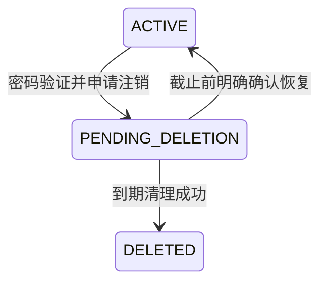

# 账号注销设计

日期：2026-09-17。状态：已在工作区实施，尚未部署至正在运行的服务。本文保留设计依据，实施记录见末节。

## 1. 实施前现状与目标

实施前项目已有以下基础实现：

- `frontend/js/main-view.js`：设置页底部的“危险操作 → 注销账号”。
- `frontend/js/main.js`：密码与“确认注销”输入弹窗、成功后清理本地登录态并断开连接。
- `POST /api/auth/disable`：验证密码、写入 `disabled` / `disabledAt`，撤销当前 Token。
- `AccountService` / `AuthService`：7 天恢复期，登录时自动恢复；过期后再次登录触发附属数据清理。

需要补齐的关键行为：

1. 到期清理依赖再次登录；玩家不回来，数据就不会通过这条路径清理。
2. 登录会自动撤销注销，缺少明确的恢复确认。
3. 当前 Token 撤销保存在进程内存中；账号恢复后，其他未过期的旧 Token 缺少账号级永久失效机制。
4. WebSocket 握手仅验证 Token，未检查账号注销状态；已有其他设备连接也需要服务端关闭。
5. 清理方法尚未覆盖军团、聊天、装备、征兵队列、地图归属等完整关联关系；按发件人删邮件还会影响其他玩家的收件箱。

目标：形成可恢复、有明确期限、全设备生效、能自动完成清理的注销流程。

## 2. 产品规则

| 项目 | 推荐规则 |
| --- | --- |
| 入口 | 设置 → 账号与安全 → 注销账号；沿用现有设置页面，不新增顶级菜单 |
| 操作对象 | 当前已登录的正式账号；明确显示账号名，防止切错账号 |
| 游客 | 不显示账号注销入口；保留离开游客模式的现有流程 |
| 验证 | 当前密码 + 输入“确认注销”，由服务端双重校验 |
| 恢复期 | 默认 7 × 24 小时，从服务端成功受理时开始；前端使用服务端返回的具体截止时间 |
| 即时效果 | 退出所有设备，禁止游戏操作；不立即删除存档 |
| 恢复方式 | 验证账号密码后展示恢复页面，点击“恢复账号并登录”才撤销注销 |
| 到期效果 | 截止时刻起不可恢复，后台自动清理；清理故障或延迟不延长恢复期 |
| 用户名 | 沿用现有“注销后不可重新注册同名账号”的规则，并在确认页提前说明 |
| 战局 | 恢复期按普通离线规则运行，不提供保护期，不回滚战斗损失 |

“退出登录”使用普通按钮；“注销账号”放在独立危险操作区，以红色文字或描边呈现。最终提交按钮才使用实心危险色。颜色沿用主题变量，适配现有三种主题。

## 3. 交互流程与文案

### 3.1 设置入口

账号与安全区域依次展示当前账号、切换账号、退出登录；其下单独展示注销卡片：

> 注销账号  ›  
> 申请后有 7 天恢复期，到期将永久清理游戏进度。

### 3.2 注销确认弹窗

复用 `modal-mask` / `modal-card`。桌面宽约 420px，手机两侧留 16px，内容超高时允许滚动。

```text
注销账号                                       ×
当前账号：远征指挥官

申请后，你将退出所有设备。
你有 7 天时间恢复账号，到期后游戏进度无法找回。

• 将清理全部城池、部队、军官、装备、道具和资源。
• 包含当前账号的金币、钻石等游戏余额。
• 恢复期内战局照常运行，城池仍可能遭到攻击。
• 注销完成后，该用户名不可重新注册。

当前密码        [请输入当前登录密码             ]
确认操作        [请输入“确认注销”               ]

[暂不注销]                         [申请注销]
```

- 密码非空且确认文字匹配时启用提交；密码允许粘贴和密码管理器填充。
- 进入弹窗不聚焦危险按钮，不通过回车直接提交。支持键盘焦点约束、标签关联和错误播报。
- 点击提交后显示“正在提交…”，锁定重复提交；提交期间不允许误关闭弹窗。
- 密码错误显示在密码框下；限流显示可重试时间；关闭弹窗即清除密码。
- 超时或断网显示“操作结果待确认”，不自动重试写请求。通过验证凭据后的状态查询确认是否已受理；页面关闭后可重新登录进入同一确认流程。
- 前置条件变化时保留弹窗，展示具体阻塞原因及处理入口。

### 3.3 受理成功页

不只显示短暂 Toast，跳转登录入口并保留结果卡片：

> 注销申请已受理  
> 可恢复至：2026-09-24 18:30（北京时间，示例）  
> 在此之前，可通过登录入口验证身份并选择恢复账号。到期后无法恢复，游戏数据将自动清理。  
> [返回登录]

服务端返回 `recoverUntil` 与 `serverNow`，客户端格式化展示并标注时区；不使用客户端时间决定能否恢复。

成功后清理 Token、账号专属缓存、轮询和 WebSocket，丢弃该会话尚未完成的旧响应。通过现有共享存储事件或 BroadcastChannel 同步其他标签页；保留主题等非账号偏好。

### 3.4 恢复账号

输入正确用户名和密码后，若处于恢复期，显示：

> 该账号正在申请注销  
> 可恢复至：2026-09-24 18:30（北京时间，示例）。恢复后，你可以继续使用当前游戏进度。恢复期内的战斗结果仍然有效。  
> [保持注销并返回]　[恢复账号并登录]

此时不发放游戏访问 Token。确认恢复才发新 Token、进入游戏；关闭页面或返回不改变注销状态。到期后提示“该账号已超过恢复期限，无法恢复”，不进入游戏。

## 4. 游戏世界与关联数据

### 4.1 恢复期

- 城池、资源、生产建设、科技、伤兵期限与战斗继续按现有离线规则结算；已有和新发起的敌方进攻均按正常规则处理。
- 不因申请注销立即释放领土或转移资产；恢复只解锁账号，不恢复到申请时快照。
- 普通军团成员保留成员关系，沿用现有成员管理规则；恢复期间仍可能被移出军团。
- 军团长若还有其他成员，须先转让团长才能申请，弹窗提供“前往军团管理”。单人军团可申请，说明到期后军团一并解散；申请后禁止其他玩家加入该单人军团。
- 排行榜隐藏申请注销的玩家；地图上的城池保留可攻击性，不暴露账号正在注销这一私密状态。

### 4.2 到期清理

| 数据类别 | 清理策略 |
| --- | --- |
| 个人进度 | 删除资源、余额、建筑、城防、科技、军官、装备、部队、伤兵、征兵与建设队列、道具、任务和引导状态；清除主表中的残余余额和资料 |
| 城池与领土 | 删除全部所属城池及城池附属数据，解除野地等归属，恢复可用地块；刷新地图缓存，不能只删城市表 |
| 行军 | 清理该账号自己的未完成行军；其他玩家指向失效目标的未结算行军按“目标已消失”转为正常返程，保留对方兵力，不发战利品 |
| 既成战果 | 截止时刻之前已经提交的战斗结果保留，禁止重复奖励或回滚其他玩家资产 |
| 军团 | 删除成员关系、申请和关联权限；清理解散单人军团的关联记录；保留其他成员及其资产 |
| 邮件与战报 | 删除该账号自己的收件箱、侦察报告；其他玩家持有的邮件和历史战报保留，发送者和参与者展示为“已注销玩家” |
| 聊天与个人资料 | 删除该账号的聊天正文和个人介绍、头像绑定等；保留必要系统事件时隐藏原账号名 |
| 账号记录 | 保留维持外键所需的最小墓碑记录、注销时间及内部用户名占用信息；移除可用密码凭据和公开资料，拒绝登录和重新注册 |

到期后即使物理清理尚未执行，逻辑上也应将目标视为已失效，禁止新建指向它的交易或行军；针对旧目标的结算必须重新检查状态。涉及多玩家的操作采用一致锁顺序与事务，避免清理后又写回资产。

备份按部署环境的保留周期自然过期；需在上线前记录实际周期与恢复时重放注销记录的措施。界面不承诺在截止瞬间擦除所有备份或他人持有的历史记录。

## 5. 服务端设计

### 5.1 状态与迁移



`PENDING_DELETION` 且 `serverNow >= recoverUntil` 为不可恢复、等待清理状态；即使作业失败也不能走恢复分支。恢复采用严格小于截止时间，到期等号归清理方。

建议新增 `accountStatus`、`recoverUntil`、`deletedAt`、`authVersion`；继续使用 `disabledAt` 记录受理时间。`recoverUntil` 创建后持久化，后续修改默认恢复天数不改变已受理申请的期限。

使用新的 Flyway 迁移，不改旧版本。兼容期保证 `disabled` 与新状态在同一事务内更新；最终以新状态为唯一业务判断依据。既有注销账号按历史 7 天配置计算截止时间，过期的进入待清理；若部署曾调整配置，迁移前先核实历史值。对 `(account_status, recover_until, id)` 建索引。

### 5.2 接口契约

| 接口 | 行为 |
| --- | --- |
| `GET /api/auth/deletion-preview`（新增） | 仅当前正式账号可用；返回账号名、恢复天数、城池数量、军团阻塞原因；提交时重新检查 |
| `POST /api/auth/disable`（复用） | 请求包含密码、确认文字与 `requestId`；成功返回 `status`、`disabledAt`、`recoverUntil`、`serverNow` |
| `POST /api/auth/login`（扩展） | 正常账号沿用现有返回；待注销账号验证密码后返回 `RECOVERY_REQUIRED`、截止时间和短期恢复凭据，不发游戏 Token |
| `POST /api/auth/recover`（新增） | 使用恢复凭据并明确确认；成功切回正常状态，发放新游戏 Token |
| `POST /api/auth/deletion-status`（新增） | 网络结果不明时，验证用户名密码后只读查询状态；不自动恢复、不发游戏 Token、不暴露他人状态 |

注销是写操作，不自动重试。以 `(playerId, requestId)` 保证已受理请求不会重复改变截止时间；已失效 Token 的重复请求仍可返回认证失败，客户端转入上述凭据验证查询。只读查询也须限流，密码及恢复凭据不记日志。

恢复凭据限定用途、有效期建议 5 分钟、一次性消费，绑定账号及本次注销申请版本，不可用于游戏接口；记录持久化，不能只依赖单实例内存。重新发起注销后，上一轮恢复凭据必须失效。

错误码至少区分：`PASSWORD_INVALID`、`CONFIRM_REQUIRED`、`GUILD_TRANSFER_REQUIRED`、`RECOVERY_EXPIRED`、`RATE_LIMITED`。密码错误与账号不存在在未认证入口使用同一提示。

### 5.3 会话、并发与清理任务

- 每次注销、恢复均递增持久化 `authVersion`；HTTP 与 WebSocket 同时验证账号状态和 Token 内版本。恢复后旧 Token 仍无效，服务重启也不改变结果。
- 历史无版本 Token 仅在账号版本为初始值且状态正常时兼容，避免上线即全员退出；一旦发生注销，不再接受无版本 Token。
- 注销事务提交后关闭该玩家的所有 WebSocket，并广播账号退出事件；多实例部署需跨实例投递，不能只关闭当前进程连接。握手注册连接后再次检查状态，防止注销与建连竞争。
- 注销、恢复、清理在事务内锁定玩家并复查状态和服务端时间；所有相关写操作在取得锁后重新检查账号状态，避免已通过鉴权的旧请求继续修改数据。
- 清理使用独立调度器，建议每分钟执行、有界分页、每个账号一个事务。支持失败记录、下轮重试与告警；不得一次扫描全表或因一个失败账号阻塞后续账号。
- 清理作业只在完整事务成功后写 `DELETED`，相关推送和缓存失效在提交后执行。数据规模超过单事务预算时，再引入分阶段清理状态和持久化进度。
- 普通 Tick 保留恢复期内正常离线结算，到期后跳过个人生产并由清理流程接管；到期玩家不能因补算再次创建已清除的数据。

## 6. 实施范围与验收

建议一次完成前后端闭环后开放入口，避免界面承诺与后台行为不一致。

1. 账号状态迁移、版本化鉴权、恢复凭据及接口契约。
2. 城池、行军、军团、邮件等清理规则与后台作业。
3. 设置入口、确认弹窗、成功卡片、恢复页面及多标签页退出。
4. 自动化与交互验收。

重点修改位置：`Player`、`PlayerRepository`、`AccountService`、`AuthService`、`AuthController`、`JwtUtil`、HTTP / WebSocket 鉴权；新增注销清理调度器；前端为 `main-view.js`、`main.js`、`api.js`、`api-client.js`、`ws-client.js` 与必要主题样式。地图、战斗、军团等模块按上述状态规则接入。

验收清单：

- 正确密码与确认文字才能提交；密码错误、游客、未登录和团长未转让均有明确处理。
- 双击、请求超时、提交成功但响应丢失，不重复申请、不误提示已失败、不延长截止时间。
- 所有设备和标签页失效，现存 WebSocket 关闭；重启服务后旧 Token 仍无效，恢复后亦不能复活旧会话。
- 普通登录不自动撤销注销；保持注销不改状态；仅明确确认且在截止前恢复成功。
- 截止前 1 毫秒、截止时刻、截止后，以及恢复和清理并发，仅能产生一个合法结果。
- 用户永不再次登录，后台也能清理；单账号失败不会阻塞其他账号，重试不重复返兵或奖励。
- 多城、野地、军官装备、生产队列、余额、军团关联无孤儿记录；地图地块可再次正常使用。
- 恢复期可正常遭遇攻击；到期未完成的敌方行军安全返程；不误删他人邮件和战报。
- 移动端、三种主题、键盘操作、实时重绘时输入保护，以及退出后旧响应隔离均通过。

## 7. 实施记录

已完成设置入口、独立确认弹窗、持续展示的受理结果、显式恢复页面；前端模块为 `frontend/js/account.js`。注销写请求不重试，响应不明时通过凭据状态查询确认；多标签页切换会隔离旧响应。

后端通过 V35 增加生命周期、持久化截止时间、会话版本及恢复凭据摘要；不新增恢复凭据表，单个账号仅保留最后一次签发的摘要和有效期。重新验证会使先前恢复凭据失效，成功恢复或重新注销会清除凭据。历史无版本 Token 仅在账号版本为零且状态正常时可用。

`AccountDeletionScheduler` 默认每 60 秒处理最多 100 个到期账号；每个账号一个事务，失败记录错误日志并在下一轮重试。`AccountSessionScheduler` 每秒检查本实例空闲 WebSocket；主动发送和心跳也重新校验数据库状态，多实例最长约一个检查周期后断开空闲连接。

清理覆盖个人附属表、城池、野地归属、军团和聊天。保留他人邮件正文与战果，隐藏发件人以及战报结构化参与者姓名；历史自由文本不重写。已失效目标的敌方行军抵达时转为正常返程，不删除他人行军或发放额外战利品。启动时的城池坐标修复也跳过到期账号，防止重建墓碑账号的城市。

补充了军团成员列表的“转让团长”按钮与事务接口；正常成员接任后，原团长可继续申请注销。当前项目的排名为军团排名，并无独立的玩家排行榜接口，因此保留军团既有排名规则。

运行参数：`game.account.cooldown-days` 默认 7；`game.account.cleanup-interval-ms` 默认 60000；`game.scheduling.enabled=false` 会停用清理和后台会话检查。V35 对历史注销账号按原默认 7 天计算期限；部署曾修改恢复天数时，需要先核实历史配置。备份保留周期由部署环境管理，本次未改备份系统。

验证使用 H2 隔离数据库及临时源码快照，没有对游戏库执行注销或清理。MySQL 专用迁移验证因未提供独立测试库而未执行；H2 执行真实 V35 脚本的迁移用例已通过。


本轮验证结果：

- 前端全量 134 项通过，其中新增 9 项覆盖注销、恢复、网络结果不明与多标签页竞态。
- 后端新增注销集成 11 项、调度 1 项、V35 迁移 1 项全部通过；原有 WebSocket 3 项回归通过。
- 独立快照后端全量 209 项：205 通过、3 失败、1 个 MySQL 专用用例按环境条件跳过。3 项失败为 `MultiCityControllerTest` 的 2 项建城资源用例，以及 `TickServiceTest.testSetTaxAndEffectiveCapacity`；在未包含本次注销改动、保留现有资源与人口调整的独立基线中复现了相同失败。
- 使用独立模拟接口检查桌面与 390px 手机布局、默认/纸色/深色主题、按钮启用、提交等待、受理结果和恢复页面，未操作真实游戏账号。
- 最后一次新增“启动修复不得重建已注销城市”防护后，重新运行注销与 WebSocket 的 16 项针对性测试并通过。
