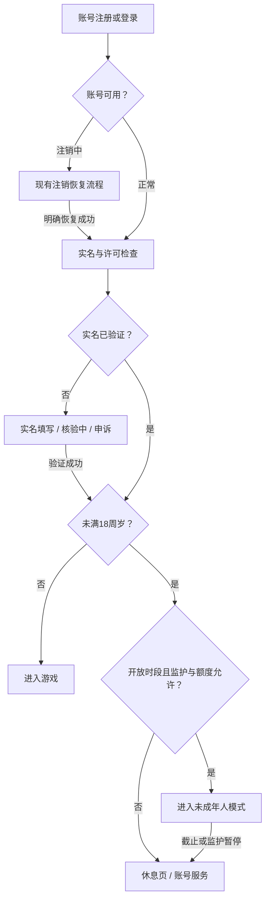

# 山河远征录：实名与防沉迷系统设计

日期：2026-09-17。状态：设计方案，未实施。适用场景：中国大陆面向公众提供网络游戏服务。

本方案结合当前工作区中的 Java / Spring Boot / MySQL / JWT / WebSocket 后端、原生 JavaScript 前端及共享世界玩法制定。依据本次实际查阅的官方文件；不将征求意见稿、厂商公告或行业倡议当作统一强制要求。正式上线前，由运营主体与出版单位复核届时有效规定、接入规范及运营日历。

建议采用“实名准入 → 服务端时段控制 → 全设备会话管理 → 消费限制 → 玩法衔接 → 监护与申诉”的完整方案。未成年人在允许的游戏时段内参与正常城建、PvE、PvP 和军团玩法，按统一战争规则结算；未成年人模式负责时间、消费与监护控制，首版建议暂不开放真实付费。

## 1. 法规依据与明确规则

| 事项 | 本方案执行规则 | 依据与性质 |
| --- | --- | --- |
| 实名 | 所有玩家使用真实有效身份信息注册、登录；接入国家新闻出版署网络游戏防沉迷实名验证系统 | [S1] 第二项，强制要求；仅校验身份证格式、短信登录或勾选“已成年”不能替代 |
| 游客 | 未实名用户不能进入网络游戏，包括游客体验；可以访问静态介绍、政策与帮助页面 | [S1] 第二项，强制要求 |
| 未成年人范围 | 未满 18 周岁；年龄依据有效实名结果，以服务端规则更新 | [S1] 第五项 |
| 游戏时段 | 周五、周六、周日和法定节假日，每日北京时间 20:00—21:00，其他时间不提供游戏服务 | [S1] 第一项，强制要求 |
| 游戏时长 | 开放日期最多 1 小时；20:40 进入，当日最多再玩 20 分钟，不能顺延至 21:40 | [S1] 第一项的产品落实 |
| 付费：未满 8 周岁 | 不提供游戏付费服务 | [S2] 第三项，强制要求 |
| 付费：已满 8、未满 16 周岁 | 单次充值不超过 50 元，同一企业每月累计不超过 200 元 | [S2] 第三项，强制要求 |
| 付费：已满 16、未满 18 周岁 | 单次充值不超过 100 元，同一企业每月累计不超过 400 元 | [S2] 第三项，强制要求 |
| 单日消费 | 还须合理限制不同年龄阶段的单次与单日累计消费；本方案首版未成年人真实付费为 0 | [S3] 第四十四条；该条没有给出统一的具体每日金额，不能只做月充值上限 |
| 未成年人模式、监护 | 设置未成年人模式，提供醒目便捷的时间、权限、消费管理功能 | [S3] 第四十三条 |
| 游戏规则与适龄提示 | 评估并修改诱导沉迷的规则；下载、注册、登录等位置显著提示适龄范围 | [S3] 第四十二、四十七条；具体年龄提示需内容评估，不能仅凭战争题材自行宣称评级 |
| 身份保护 | 不满 14 周岁个人信息适用专门规则及监护人同意要求；实名资料按敏感信息保护 | [S4] 第二十八至三十一条，并结合第十三条明确各处理活动的合法性基础 |
| 投诉与运营 | 提供投诉举报渠道，每年公布防沉迷工作情况；处理未成年人个人信息按要求每年审计 | [S3] 第七、三十七、四十二条 |

注意：2019 年通知中的“游客体验”“平日 1.5 小时、节假日 3 小时”已被 2021 年不一致的新规定替代，不能沿用。成年人不适用上述未成年人一小时限制；可提供自愿休息提醒，不宣称成年人也被国家统一要求定时强退。

节假日不能直接取第三方日历的 `isHoliday`：法定节假日、调休休息日、调休工作日应分别保存，以正式文件和主管部门执行口径形成逐日运营日历。寒暑假不等于每天可以游戏；同一天兼具周末与节假日也不叠加时长。调休涉及的特殊执行日期须经复核明确，不能照搬某家厂商的排期。

## 2. 当前游戏的差距

| 已核对位置 | 当前行为 | 设计改动 |
| --- | --- | --- |
| `AuthService.register/createGuest`、`AuthController`、`main.js` | 用户名密码注册或游客创建后，初始化角色并发放 JWT | 增加实名流程；未完成前仅发账号管理凭据，不初始化可玩角色、不发游戏权限；生产关闭游客 API 与入口 |
| `Player`、`JwtAuthenticationFilter`、`SecurityConfig` | 已有账号注销状态和 `authVersion`，未见实名年龄与防沉迷判断 | 身份状态、游戏许可独立于注销状态；所有游戏 HTTP 请求统一校验 |
| `JwtHandshakeInterceptor`、`GameWebSocketHandler` | 检查账号、JWT 与版本，支持多标签连接；在线心跳超时为 90 秒 | 握手、消息、推送和到点断连接入同一许可规则；90 秒在线状态不能当作超时宽限 |
| `ShopController.recharge`、`recharge.js` | 6、30、98、198、328、648、1280 元及月卡档位；实际为直接发钻石，无真实扣款 | 区分模拟发放与真实支付；公共生产环境关闭模拟充值，真实支付启用前完成订单与限额系统 |
| `TickScheduler`、`TickService`、`MarchService` | 城建、资源、征兵、行军等服务端持续结算 | 分离后台世界结算与玩家在线服务；禁止通过计时任务替未成年人持续发出新指令 |
| `WoundedService`、`docs/WOUNDED.md` | 伤兵按受伤时间保留 7 天，到期消失 | 增加可在下一开放窗口处理的救治期限保护，避免被迫在禁玩时段救治 |
| `QuestCatalog` | 第四章 `q4_3` 要求对玩家宣战，`q4_4` 要求玩家城获胜 | 保留原任务目标与奖励；宣战、出征和领奖须在允许的游戏时段操作，后台战果正常记录任务进度 |
| 军团、地图、邮件、聊天、新手引导 | 都是可交互游戏服务 | 非开放时段一并限制；不保留“只能看地图/聊天/领奖”的绕过入口 |

当前工作区已有其他未提交开发变更，本文件只描述新设计。代码证据以本次读取的实际源文件为准；旧维护文档中“保留模拟充值”的历史安排不等于公众运营方案。

## 3. 玩家流程与界面

### 3.1 实名页

- 登录页展示适龄提示、实名与防沉迷说明、隐私政策、儿童个人信息规则、客服及监护入口；移除“游客模式”及快捷键。
- 注册前展示必要信息告知和儿童监护流程入口。未满 14 周岁由监护流程完成必要同意；不能先采集并核验全部儿童资料，再补一个同意勾选框。
- 仅采集当前接入方式必要的信息。姓名、证件种类与号码提交给服务端，由服务端按正式接入协议核验；不在浏览器内放认证密钥。
- 页面区分“待填写”“核验中”“通过”“未通过”“暂时不可用”，核验中不能先玩。失败提示可修改或申诉，不暴露第三方原始错误及他人身份信息。
- 姓名与证件不进入 localStorage、URL、埋点、错误日志或客服普通工单；关闭或提交结束后清除输入。普通游戏接口和地图资料不返回真实身份。
- 旧账号首次升级后同样补实名，不能默认成年；存档保留，未实名时只开放账号与申诉服务。
- 已实名身份不能直接在设置中换绑为成年人；纠错需人工审核与重新核验，保留处理记录。

### 3.2 游戏内提醒

顶部状态条显示“未成年人模式 · 今日 21:00 结束”，点击可查看开放规则、剩余时间与监护设置。复用现有主题变量和 `modal-mask` / `modal-card`，文案不责备玩家。

按本次实际截止时间提前 15、5、1 分钟提醒，晚进入不补弹全部历史提醒。若监护人设置更短时长或更早结束，以更早时间为准。提醒没有“再玩一会儿”“支付延长”按钮。

20:55 提示示例：

> 今日游戏服务将在 5 分钟后结束。已提交的建设和行军将按规则结算，你可以下次开放时查看结果。请合理安排休息。

21:00 休息页示例：

> 今日游戏时间已结束
>
> 下次开放：由服务端返回的日期 20:00—21:00（北京时间）。
>
> 你已提交的操作记录会保留。
>
> [账号与安全] [家长监护与帮助] [退出账号]

休息页移除实时地图、资源面板、战报、军团聊天等游戏内容。账号注销、隐私权利、身份申诉、退款与客服仍可办理，不要求等到下一游戏时段。

### 3.3 到点行为

1. 服务端在截止时间立即拒绝新的游戏指令、游戏数据读取及游戏 WebSocket 推送；主动关闭所有相关设备连接。
2. 前端取消轮询、停止重连、终止引导自动步骤、清除游戏缓存及当前视图，跳转休息页；所有标签页同步。
3. 客户端丢弃旧会话中迟到的响应，不允许旧 `state` 重绘游戏。下次许可恢复后重新拉取权威状态。
4. 已在截止前合法受理并提交的交易保留；处于锁等待、尚未获准执行的写请求重新校验时间，过期则拒绝。禁止用请求最初到达时间给长队列续期。
5. 后台异步结算不要求玩家留在页面；不会因关闭弹窗、刷新、更改本机时间、切换城市或换设备延长许可。

## 4. 与策略游戏玩法的结合

下表是本项目产品设计，并非国家逐项规定的游戏规则。未成年人参与现有共享世界与正常战争，防沉迷通过服务端准入、到点下线、提醒和监护管理执行；游戏时段结束时，战局按普通离线规则继续。

| 玩法 | 首版建议 |
| --- | --- |
| 城建、征兵、科技 | 保留已提交的有限队列正常离线结算；不得在下线后自动连续下单、自动加速或自动消费 |
| 资源产出 | 沿用普通离线产出与仓储规则，不设计“每隔数分钟上线收取，否则永久损失”的额外奖励 |
| 行军、NPC 战斗 | 已发出的单次任务按规则完成并返程，下次查看战报；不提供离线自动刷怪、自动续采、代操作 |
| 玩家战争 | 允许在开放时段内按正常规则宣战、侦察、出征和防守操作；下线后城池仍可能被攻击、掠夺或占领，现有护盾及免战规则照常生效 |
| 共享世界 | 沿用统一地图、领土、资源与军事协作规则；运输、驻军等以游戏已支持的功能及权限为准，主动操作统一受时段控制 |
| 第四章主线 | 保留 `q4_3/q4_4` 的玩家宣战与玩家城获胜目标及奖励；任务进度跨开放日保留，后台结算正常计入进度 |
| 伤兵 | 建议未成年人伤兵到期取“原 7 天截止”与“该截止之后首个开放窗口结束”的较晚值；持久化有效期限，查询、治疗、定时清理统一使用；不自动扣钻救治 |
| 任务、月卡、奖励 | 任务跨开放日保留；已取得的奖励不要求禁玩时段领取。若以后销售月卡，应支持合法开放日领取或累计，不用断签损失诱导每日上线 |
| 军团 | 沿用现有成员、团长及军事协作权限；未成年人在开放时段内操作，到点后同样停止管理、聊天和支援指令，不因团长身份延长时间 |
| 通知 | 禁玩时段不推送“敌人来袭、立即上线救城”等召回信息；安全通知、申诉、退款进展属于账号服务 |

防沉迷状态由服务端控制，不公开玩家年龄或“这是儿童账号”，不能在排行榜、军团、地图中提供未成年人筛选。对外按现有规则展示城池战争及护盾状态。

21 点下线不会触发自动免战、强制撤军、释放领土或回滚战果。截止前合法提交的行军和已有战争按正常规则继续结算；其他玩家的合法进攻照常处理，未成年人只能在下一允许时段查看战报和发出新指令。跨时段战斗、兵力与奖励结算须保持事务及幂等保证。

未成年人模式说明与下线提醒应明确“离线期间战局继续，城池仍可能受到攻击”。战斗未结束、城池被攻击或需要处理军团事务均不能延长法定游戏时间，监护人也不能授权例外上线。新手引导不得把保持在线守城作为完成条件。

普通持久世界的无人交互结算与禁玩时段“提供服务”的接入、审核口径，应由出版单位确认；后台结算设计不能被解释为允许禁玩时段在线挂机或远程代操作。

## 5. 服务端控制

### 5.1 权限分层

建议新增 `RealNameService`、`AntiAddictionService`、`PlaySessionService`、`GameAccessGuard`、`HolidayCalendarService`、`GuardianService`。第一阶段使用现有 MySQL 事务和行锁即可，不必为了防沉迷立即引入新的微服务。

- **账号凭据**：仅可实名、查看许可状态、账号安全、注销恢复、监护和申诉；服务端以明确的权限范围鉴权，不靠前端隐藏按钮。
- **游戏会话**：实名通过且当前允许游戏才发放，绑定账号、实名主体、会话 ID、权限版本和绝对截止时间；JWT 有效不等于始终允许游戏。
- **权限判断**：账号正常、实名有效、年龄分组、开放日历、当前时刻、已用时长、监护限制、会话版本全部满足才放行。成年状态不得信任客户端提交的年龄字段。
- **账号恢复**：现有 `/api/auth/recover` 恢复后重新计算游戏许可，不能直接绕过实名或时间限制签发原有完整游戏 Token。
- **白名单**：只放行明确列出的非游戏账号服务。`/api/game/**` 的读写、新手引导、地图、商城、聊天、邮件均受保护；`/api/auth/tutorial/dismiss` 这类游戏操作也要覆盖。

`GameAccessGuard` 放在 JWT 身份校验之后；关键资产操作在事务中、获得业务锁后再次检查。不能把限制直接塞进所有 `TickService` 调用，使合法的后台世界结算一起停摆。

### 5.2 时间与会话

- 统一使用可信服务端 `Clock`；存储 UTC 时间戳，日历及自然月按 `Asia/Shanghai` 计算。开放区间为 `[20:00:00, 21:00:00)`，21:00:00 属于拒绝范围。
- 返回 `serverNow`、`allowedUntil`、`nextWindowStart`、`remainingSeconds`、`policyVersion`；前端倒计时只用于提示，后台标签暂停计时不影响服务端。
- 未成年人按同一实名主体在本游戏的所有账号、角色、城市、设备合并限制；不能在注销、重注册、切换服务器后清零。跨企业的全行业额度不在本项目能力范围内，不宣称实现。
- 建议一个实名主体只允许一个活跃逻辑游戏会话，多标签共用会话；换设备时原子撤销旧会话。服务器持久化去重后的服务区间，重连不重复累计也不返还已经使用的时间。
- 心跳租约建议 30 秒续约、最长 60 秒，但一律截断于 `allowedUntil`；断网后失去有效租约，任何新操作须重新申请。租约用于失联处理，不能让 21 点后的会话继续获得服务。
- 可服务时长取“每日未用额度、距当前窗口结束、监护剩余额度”中的最小值，离线不积攒补时。记录租约与真实会话活动，不能把已有 `last_tick` 或 WebSocket 在线人数作为用时账本。
- 服务端重启后从账本恢复；双实例使用共享持久状态。计划任务主动断连，HTTP 每次授权及 WebSocket 每次收发再次兜底，即使调度延迟也不继续服务。
- 8、14、16、18 周岁边界按已核验出生信息或平台有效年龄结果处理；会话/年龄缓存不得跨越下一年龄生效边界。没有可信更新依据时不自动放宽到成年人。

### 5.3 故障与接入

- 使用 `RealNameProvider` 隔离正式平台接入和测试实现。实名提交、查询、签名、加密、结果标识、在线行为上报的字段及频率全部以正式接入文档为准，本方案不猜测平台协议。
- 核验超时保持 `PENDING`，用请求流水查询结果；未验证或结果失效不得按成年人放行。已经持有有效核验结果的账号依平台有效期规则使用，不要求每个业务请求都调用外部系统。
- 游戏许可账本、日历或可信时间不可用时拒绝新的未成年人游戏授权；不回退到浏览器时间或“默认成年”。日历覆盖到期前告警，缺失日期不自动多放开。
- 上下线等必要上报通过事务事件表可靠发送，支持去重、补报及告警；上报失败的具体处置依正式协议执行，不通过关闭防沉迷解决。
- 本地开发使用人工构造的测试身份与固定时钟。生产构建禁止 Mock 实名、游客、模拟充值及防沉迷绕过开关；公开测试不能借“测试服”名义放开未实名服务。

### 5.4 建议数据模型

| 表/对象 | 核心字段及约束 |
| --- | --- |
| `identity_subject` | 内部主体 ID、平台去标识化标识、核验状态、受保护年龄依据、核验时间；必要身份字段加密且单独授权 |
| `player_identity` | 账号与主体绑定、身份版本、绑定及纠错记录；同主体多账号映射一致 |
| `verification_request` | 唯一请求号、平台流水、状态、重试/查询状态；不保存无必要的完整明文请求体 |
| `guardian_binding` | 经验证的监护关系、同意版本、权限、消费与时间上限；不能仅凭知道儿童账号名建立关系 |
| `play_session` | 主体、游戏、账号、会话 ID、开始/到期/结束、租约、版本、结束原因 |
| `play_usage_daily` | 唯一键 `(subjectId, gameId, 北京日期)`，累计用时及版本；按真实服务区间去重并原子更新 |
| `play_calendar` | 北京日期、开放窗口、法定假日/调休元数据、来源、规则版本、审核及生效记录 |
| `compliance_event` / `report_outbox` | 决策结果、原因、策略版本、追踪号、必要上报载荷与发送状态；敏感字段脱敏 |
| 后续支付表 | 服务端订单金额、实名主体、企业范围、支付状态、日/月额度占用、退款、幂等键与支付流水 |

按开发时最新版本新增 Flyway 迁移，不预占当前工作区的下一个版本号，不修改历史迁移。账号注销状态与身份状态分别建模，不能用 `disabled` 同时表示禁玩或实名失败。

### 5.5 建议接口契约

| 接口 | 用途 |
| --- | --- |
| `POST /api/identity/verify` | 账号权限下提交实名；限流、幂等、必要告知/同意凭据校验 |
| `GET /api/identity/status` | 返回脱敏状态与可执行下一步，不返回完整证件 |
| `GET /api/anti-addiction/status` | 返回许可、原因、北京时间窗口、剩余秒数及策略版本；休息页可用 |
| `POST /api/play-sessions` | 申请游戏会话；重复请求不能创建多份额度 |
| `POST /api/play-sessions/heartbeat` | 更新活动与返回最新许可；不能延长窗口 |
| `POST /api/play-sessions/end` | 幂等结束本会话；不依赖浏览器一定会调用 |
| `/api/guardian/*` | 监护关系核验、汇总查询、收紧限制、申诉；独立鉴权和审计 |

统一错误使用稳定 `code`，例如 `REAL_NAME_REQUIRED`、`VERIFICATION_PENDING`、`PLAY_WINDOW_CLOSED`、`PLAY_TIME_EXHAUSTED`、`GUARDIAN_RESTRICTED`、`PAYMENT_LIMIT_EXCEEDED`。权限限制返回 403，真正登录失效返回 401，基础设施暂不可用返回 503；前端不能把防沉迷拒绝当作普通掉线不停重登。

WebSocket 增加 `anti_addiction_warning` 与 `game_access_revoked` 事件；停止授权后不再发送游戏载荷。账号身份纠错、监护暂停、注销使用持久化版本撤销权限，向所有实例传播；不能只断开当前设备。

## 6. 消费设计

### 6.1 首版推荐

未成年人真实付费关闭，成年人支付也必须等正式支付接入完成才能开放。这是项目自选的较严格产品策略，不是宣称法规禁止所有未成年人充值。未成年人可在允许的游戏时段使用正常玩法获得的免费资源；赠送钻石与付费钻石应区分来源。

现有“模拟充值”没有实际人民币交易，不能把页面显示金额计入真实充值账本，也不能声称当前系统已做真实支付合规。开发/内部测试中可以保留隔离的模拟发放；公共生产环境禁止直接调用它增加资产。

### 6.2 后续开放未成年人付费时

| 年龄 | 国家单次/月充值上限 | 当前档位在单次上限下的候选（仍须检查剩余额度） |
| --- | --- | --- |
| 未满 8 | 0 / 0 | 无 |
| 8—15 | 50 / 200 元 | 6、30 元；30 元月卡需另行审核权益设计 |
| 16—17 | 100 / 400 元 | 6、30、98 元；30、98 元月卡需另行审核权益设计 |
| 18 及以上 | 不适用上述未成年人上限 | 按正常支付、消费者保护与风控规则 |

启用前还要定出按年龄划分的单日消费上限和虚拟币消费控制，明确它们是企业策略，而非凭空引用国家统一数字；未配置就保持关闭。月上限是同一企业累计，不能按账号、单服、渠道或游戏分别放大。

支付后端必须同时做到：

1. 以服务端 SKU 定价，金额用人民币分的整数保存；忽略客户端 `rmb`、`diamond` 等自报金额。
2. 新建订单前校验身份、游戏时段、监护限制、年龄单次上限、单日消费规则与企业自然月累计。
3. 以主体和企业额度账本原子预占待支付金额；两台设备同时下单也不能超额。创建订单幂等，支付流水唯一，回调验签和到账幂等。
4. 未支付订单不能跨 21 点延续购买权限；对关闭与支付并发竞态查单处理。已合法支付但延迟回调的订单记账不丢单，权益下次允许游戏时可见，不能重新开放游戏；关闭后才成功的异常付款进入退款/人工处理路径。
5. 月份归属按确定的支付时间规则落账，跨月支付原子迁移预占并重新检查目标月额度，不凭创建时间绕过限额。16 岁生日当月计入全月已有充值，不清零；18 岁转换须有可信年龄依据。
6. 退款保留原交易记录，首版采用当期成功充值毛额占限、退款不自动恢复可用额度的保守规则并告知；不能循环充值退款刷额度。依法受理退款请求，不以“已实名”为理由一概拒绝。
7. 官网、渠道、礼包、月卡、代充等凡本企业提供的付费路径都接入同一控制，禁止以礼品卡或资产转赠绕过。充值限额与消耗虚拟币的日消费控制分别核算，避免把同一笔钱重复认定为充值。

## 7. 监护、隐私与运营

- 监护中心提供游戏时间、消费汇总、禁止付费、缩短时长、暂停游戏、功能权限管理、投诉退款和解绑申诉。监护人只能收紧法定上限，不能授权周一游戏或延长至 21 点后。
- 监护绑定需可信身份与关系核验或人工材料审核，建立访问审计；一条短信、一个勾选框不能证明监护关系。儿童基本信息收集前的监护流程与长期监护管理共用可审计记录。
- 只展示履行监护必要的数据，不默认提供全部聊天内容、位置或他人身份。实名主体 ID、证件摘要即使去标识化，仍按个人信息管理。
- 身份资料独立加密存储、密钥与数据库隔离、最小权限访问；禁止身份证明文或无密钥简单哈希作为公开唯一标识。优先使用平台允许的去标识化主体标识，确需关联摘要时使用密钥化方案。
- 对敏感信息处理、委托核验等完成个人信息保护影响评估，记录各项处理的目的、法律基础、接收方和期限。评估报告及处理情况记录至少保存三年 [S4] 第五十六条；这不等于全部身份证与行为日志都保存三年。
- 单独制定实名资料、会话记录、交易凭证、监管上报、申诉材料的最短必要保存期限，落实适用的法定留存。接入现有账号注销清理，依法仍需留存的数据隔离使用并说明原因，到期删除或匿名化，不能无限期保留身份资料防重注册。
- 普通实名不默认要求上传身份证照片或人脸。疑似冒用、租售账号进入必要且适度的复核与申诉；具体采用人脸时须另行评估适用规范、必要性和替代方式，不宣称所有玩家都必须刷脸。
- 军团聊天、邮件增加举报、屏蔽、陌生消息限制与处置流程，避免保护措施只剩倒计时；未成年人不进行基于画像的自动化商业营销 [S3] 第二十四条。
- 运营后台显示实名成功率、未验证准入数、禁玩时段成功请求数、强退失败、日历覆盖期、上报失败和超额支付。任何禁玩时段成功授权或未验证准入均应告警并追查。

## 8. 实施顺序与验收

**阶段一：准入与时段控制。** 接入真实核验、移除生产游客、旧账号补实名、凭据分层、日历与会话账本、HTTP / WebSocket 全路径限制、儿童信息与监护基础流程、休息页。真实支付保持关闭。

**阶段二：玩法与运营闭环。** 完成正常 PvP 与主线任务的时段衔接、伤兵期限、跨窗口结算、奖励领取安排、军团操作权限边界、监护权限、客服与上报审计。这些项目在面向未成年人发布前一并验收，不能理解为先开放再慢慢补齐。

**阶段三：可选付费。** 引入正式订单、支付、企业共享额度及日消费账本，完成退款与跨渠道测试后，再决定是否向符合条件的未成年人开放。

| 验收场景 | 预期结果 |
| --- | --- |
| 未实名、核验中、失败、旧版本 JWT、直接调用游客 API | 无法读取或操作游戏；可访问规定的账号服务 |
| 普通周一、寒暑假工作日、开放日 19:59:59 / 20:00:00 / 20:59:59 / 21:00:00 | 严格按照日历及半开区间判定；边界无多一分钟 |
| 法定节假日与周末重叠、调休日、跨年日历缺失 | 不叠加、不误放开，缺失配置告警；展示与服务端一致 |
| 20:40 登录、20:55 换设备、修改本机时间、海外时区 | 最迟北京时间 21:00 停止；不会重新获得一小时 |
| 多账号同主体、多标签、双后端实例、服务重启 | 同一账本与版本生效，不能重置或双花时长 |
| WebSocket 调度延迟、后台标签休眠、HTTP 轮询、直接脚本请求 | 不依赖前端强退；截止后不再返回游戏数据或执行新指令 |
| 20:59:59 发起且长时间等锁、21:00 到达的旧请求 | 获锁后重新授权，已超时的指令拒绝；合法已提交结果不重复执行 |
| 已提交建设/行军在禁玩期间完成、新手引导恢复 | 不丢进度、不额外发起新操作；结果只在下次合法会话展示 |
| 未成年人主线第四章、正常宣战与军事协作 | 原任务目标可正常完成；开放时段内按现有权限操作，截止后新指令被拒绝 |
| 未成年人到点下线时仍有行军、战争或敌方进攻 | 战局按普通离线规则结算，现有护盾正常生效；不自动免战、撤军、回滚战果或延长游戏时间 |
| 伤兵到期正好落在禁玩时段 | 查询、救治和定时清理一致使用受保护期限，无先删后恢复 |
| 8 / 14 / 16 / 18 周岁边界、身份纠错、监护收紧 | 按可信年龄及权限版本更新；待审核不能先解除限制 |
| 两笔并发充值、重复回调、跨月订单、退款、不同渠道 | 不超额、不重复发货、不重复返额度；未成年人支付关闭时一律拒绝 |
| 注销、恢复、重新注册、身份资料清理 | 注销与实名权限互不绕过；依法保留的当前额度不因重注册重置 |
| 日志、埋点、错误响应、导出、他人地图与军团资料 | 不泄露证件、出生日期、未成年人标签或其他敏感信息 |

实现时使用可注入时钟覆盖边界测试；多实例/并发与迁移使用独立测试库。当前仅新增设计文档，没有运行游戏实现测试，也没有完成实名平台联调。

## 9. 上线前需落实的外部条件

这些事项不阻碍方案设计，但决定能否完成生产接入：运营与出版主体、游戏上线所需审批及资质、实名平台正式接入权限与最新文档、支持证件种类与特殊身份核验路径、经审核的适龄提示及运营日历、监护关系核验渠道、客服和数据处理制度。本方案不能替代这些手续，也不能以免费或网页游戏为由免除防沉迷。

本稿采用的产品方案为：未成年人正常参与 PvE、PvP 和军团玩法，游戏权限全服务端控制，首版建议不开真实付费。若后续决定开放未成年人付费，应先完善对应设计与验收，不降低实名和时段底线。

## 10. 官方来源

本次查阅日期：2026-09-17。以下为已读取全文的主要依据；平台技术规范与具体年度运营日历尚未取得，不声称已完成正式接入审查。

- **[S1]** 国家新闻出版署《关于进一步严格管理 切实防止未成年人沉迷网络游戏的通知》，国新出发〔2021〕14号，2021-09-01 施行：[中国政府网全文](https://www.gov.cn/zhengce/zhengceku/2021-09/01/content_5634661.htm)。
- **[S2]** 国家新闻出版署《关于防止未成年人沉迷网络游戏的通知》，国新出发〔2019〕34号，2019-11-01 施行；与 [S1] 不一致之处以 [S1] 为准：[国家新闻出版署全文](https://www.nppa.gov.cn/xxgk/fdzdgknr/zcfg_210/gfxwj_215/201911/t20191119_4695.html)。
- **[S3]** 《未成年人网络保护条例》，国务院令第 766 号，2024-01-01 施行：[教育部转载国务院全文](https://hudong.moe.gov.cn/jyb_xxgk/moe_1777/moe_1778/202310/t20231025_1087333.html)。
- **[S4]** 《中华人民共和国个人信息保护法》，2021-11-01 施行：[中国人大网全文](http://www.npc.gov.cn/npc/c2/c30834/202108/t20210820_313088.html)。
